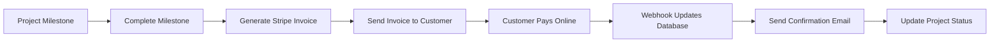

# End-to-End Payment Workflow Testing Guide

## Phase 2.7: End-to-End Payment Workflow Testing

### Overview
This guide provides comprehensive testing procedures for the complete payment transparency workflow, from milestone completion through invoice generation, payment processing, and customer notifications.

---

## 🔄 1. Complete Workflow Overview

### Payment Transparency Workflow


### Key Components Integration
- **Database**: Supabase with Phase 2 schema
- **Payments**: Stripe invoicing + payment processing
- **Authentication**: Customer portal access
- **Notifications**: Email automation via SendGrid
- **Real-time Updates**: Webhook-driven status sync

---

## 🧪 2. Testing API Endpoints

### Workflow Test API
**Base URL**: `/api/workflow/test`

#### Available Test Types:

| Test Type | Endpoint | Description |
|-----------|----------|-------------|
| Complete Workflow | `GET /api/workflow/test?type=complete` | Full end-to-end test |
| Milestone Completion | `GET /api/workflow/test?type=milestone_completion` | Tests milestone → invoice flow |
| Invoice Creation | `GET /api/workflow/test?type=invoice_creation` | Tests Stripe invoice generation |
| Payment Processing | `GET /api/workflow/test?type=payment_processing` | Tests payment intent creation |
| Notification Flow | `GET /api/workflow/test?type=notification_flow` | Tests email notifications |
| Database Updates | `GET /api/workflow/test?type=database_updates` | Tests data persistence |

#### Test Commands:
```bash
# Complete end-to-end workflow test
curl http://localhost:3000/api/workflow/test?type=complete

# Individual component tests
curl http://localhost:3000/api/workflow/test?type=milestone_completion
curl http://localhost:3000/api/workflow/test?type=invoice_creation
curl http://localhost:3000/api/workflow/test?type=payment_processing
curl http://localhost:3000/api/workflow/test?type=notification_flow
curl http://localhost:3000/api/workflow/test?type=database_updates
```

---

## 📋 3. Manual End-to-End Testing

### Pre-Testing Setup
- [ ] Development server running (`npm run dev`)
- [ ] Supabase database with Phase 2 schema
- [ ] Stripe test environment configured
- [ ] SendGrid email service configured
- [ ] All environment variables set

### 3.1 Complete Workflow Test

#### Step 1: Create Test Project
```sql
-- Create test customer
INSERT INTO customer_profiles (id, email, first_name, last_name, phone, project_ids, created_at)
VALUES (
  'test-customer-workflow',
  'test-workflow@curlfeather.com',
  'John',
  'Workflow',
  '(555) 123-4567',
  '{"test-project-workflow"}',
  NOW()
);

-- Create test project
INSERT INTO projects (id, name, description, customer_id, status, address, estimated_start_date, estimated_completion_date, created_at)
VALUES (
  'test-project-workflow',
  'End-to-End Test Project',
  'Testing complete payment workflow',
  'test-customer-workflow',
  'in_progress',
  '123 Test St, Test City, TS 12345',
  NOW(),
  NOW() + INTERVAL '30 days',
  NOW()
);

-- Create test milestone
INSERT INTO project_milestones (id, project_id, title, description, status, amount, due_date, line_items, created_at)
VALUES (
  'test-milestone-workflow',
  'test-project-workflow',
  'Foundation Complete',
  'Foundation work completed and ready for inspection',
  'in_progress',
  250000, -- $2,500.00 in cents
  NOW() + INTERVAL '7 days',
  '[{"description": "Foundation work", "quantity": 1, "unitPrice": 250000, "category": "labor"}]',
  NOW()
);
```

#### Step 2: Complete Milestone via API
```bash
curl -X POST http://localhost:3000/api/stripe/invoice-automation \
  -H "Content-Type: application/json" \
  -d '{
    "action": "complete_milestone",
    "projectId": "test-project-workflow",
    "milestoneId": "test-milestone-workflow",
    "completionNotes": "Foundation work completed successfully. Ready for next phase."
  }'
```

**Expected Response:**
```json
{
  "success": true,
  "stripeInvoiceId": "in_1234567890",
  "hostedInvoiceUrl": "https://invoice.stripe.com/i/acct_xxx/test_xxx",
  "message": "Invoice created and sent for milestone: Foundation Complete"
}
```

#### Step 3: Verify Database Updates
```sql
-- Check milestone status
SELECT id, status, stripe_invoice_id, completed_date
FROM project_milestones 
WHERE id = 'test-milestone-workflow';

-- Expected: status = 'invoiced', stripe_invoice_id populated, completed_date set
```

#### Step 4: Verify Stripe Invoice
```bash
# Test Stripe invoice retrieval
curl http://localhost:3000/api/stripe/webhook/test?type=invoice
```

#### Step 5: Test Customer Payment Flow
1. **Open hosted invoice URL** (from Step 2 response)
2. **Fill payment details** (use Stripe test card: `4242424242424242`)
3. **Submit payment**
4. **Verify webhook processing**

#### Step 6: Verify Payment Webhook
```bash
# Check webhook logs in terminal
# Look for: "Invoice payment succeeded: in_1234567890"
```

#### Step 7: Verify Final Database State
```sql
-- Check final milestone status
SELECT id, status, payment_date, stripe_payment_intent_id
FROM project_milestones 
WHERE id = 'test-milestone-workflow';

-- Expected: status = 'paid', payment_date set, stripe_payment_intent_id populated
```

### 3.2 Customer Portal Integration Test

#### Step 1: Customer Authentication
1. **Navigate to**: `http://localhost:3000/customer-portal`
2. **Create account** with email: `test-workflow@curlfeather.com`
3. **Verify login** redirects to dashboard

#### Step 2: Project Visibility
- [ ] **Project appears** in customer dashboard
- [ ] **Milestone status** shows as "Invoiced" or "Paid"
- [ ] **Invoice link** accessible from portal
- [ ] **Payment history** displays correctly

#### Step 3: Payment from Portal
- [ ] **Click "Pay Invoice"** button
- [ ] **Redirects to Stripe** hosted page
- [ ] **Payment processes** successfully
- [ ] **Returns to portal** with updated status

### 3.3 Email Notification Testing

#### Expected Email Flow:
1. **Milestone Completion**: Customer receives project update
2. **Invoice Created**: Customer receives invoice notification  
3. **Payment Successful**: Customer receives payment confirmation

#### Verification:
```bash
# Check email automation service
curl http://localhost:3000/api/workflow/test?type=notification_flow
```

---

## 🔍 4. Automated Testing Suite

### Running Complete Test Suite
```bash
# Run all workflow tests
npm run test:workflow

# Or manually via API
curl http://localhost:3000/api/workflow/test?type=complete
```

### Expected Test Results
```json
{
  "success": true,
  "testType": "complete",
  "results": {
    "workflowId": "workflow-1234567890",
    "timestamp": "2024-01-15T10:30:00Z",
    "steps": {
      "setup": {"success": true},
      "milestoneCompletion": {"success": true, "stripeInvoiceId": "in_xxx"},
      "invoiceVerification": {"success": true, "invoiceStatus": "open"},
      "paymentSimulation": {"success": true, "invoicePayable": true},
      "databaseVerification": {"success": true, "milestoneStatus": "invoiced"},
      "notificationTest": {"success": true}
    }
  },
  "summary": {
    "totalSteps": 6,
    "passedSteps": 6,
    "message": "Complete workflow test passed ✅"
  }
}
```

---

## 📊 5. Performance Testing

### Load Testing Payment Workflow
```bash
# Test multiple concurrent milestone completions
for i in {1..5}; do
  curl -X POST http://localhost:3000/api/stripe/invoice-automation \
    -H "Content-Type: application/json" \
    -d "{
      \"action\": \"complete_milestone\",
      \"projectId\": \"load-test-project-$i\",
      \"milestoneId\": \"load-test-milestone-$i\"
    }" &
done
```

### Database Performance Monitoring
```sql
-- Monitor query performance during testing
SELECT 
  query,
  mean_exec_time,
  calls,
  total_exec_time
FROM pg_stat_statements 
WHERE query LIKE '%project_milestones%' 
ORDER BY mean_exec_time DESC;
```

---

## 🚨 6. Error Scenario Testing

### Invalid Data Handling
```bash
# Test invalid project ID
curl -X POST http://localhost:3000/api/stripe/invoice-automation \
  -H "Content-Type: application/json" \
  -d '{"action": "complete_milestone", "projectId": "invalid", "milestoneId": "invalid"}'

# Expected: {"success": false, "error": "Project not found"}
```

### Payment Failures
1. **Use declined card**: `4000000000000002`
2. **Verify error handling** in webhook
3. **Check database** remains consistent

### Network Interruptions
1. **Disconnect internet** during milestone completion
2. **Verify graceful degradation**
3. **Test retry mechanisms**

---

## 🔒 7. Security Testing

### Payment Security
- [ ] **SSL/TLS encryption** for all payment flows
- [ ] **Webhook signature** verification working
- [ ] **Customer data** properly isolated (RLS)
- [ ] **PCI compliance** maintained in payment flow

### Authentication Security
- [ ] **Unauthorized access** blocked to invoices
- [ ] **Cross-customer data** access prevented
- [ ] **Session management** secure

---

## 📋 8. Integration Points Verification

### Stripe Integration
- [ ] **Customer creation** synced between systems
- [ ] **Invoice generation** working correctly
- [ ] **Payment processing** handling all card types
- [ ] **Webhook events** processing reliably

### Database Integration
- [ ] **ACID transactions** maintaining consistency
- [ ] **Foreign key constraints** enforced
- [ ] **RLS policies** preventing data leaks
- [ ] **Backup/recovery** procedures tested

### Email Integration
- [ ] **SendGrid delivery** successful
- [ ] **Email templates** rendering correctly
- [ ] **Delivery tracking** functional
- [ ] **Bounce handling** implemented

---

## 📈 9. Monitoring & Observability

### Key Metrics to Monitor
```javascript
// Workflow success rate
const workflowSuccessRate = successfulWorkflows / totalWorkflows;

// Average completion time
const avgCompletionTime = totalWorkflowTime / completedWorkflows;

// Payment conversion rate
const paymentConversionRate = paidInvoices / sentInvoices;

// Error rates by component
const errorRates = {
  milestoneCompletion: milestoneErrors / totalMilestones,
  invoiceCreation: invoiceErrors / totalInvoices,
  paymentProcessing: paymentErrors / totalPayments
};
```

### Logging Strategy
```bash
# Check application logs
tail -f logs/workflow.log

# Check Stripe webhook logs
curl -X GET https://api.stripe.com/v1/events \
  -H "Authorization: Bearer sk_test_..."

# Check Supabase logs
npx supabase logs
```

---

## 🔧 10. Troubleshooting Guide

### Common Issues

| Issue | Symptoms | Solution |
|-------|----------|----------|
| Milestone won't complete | API returns 500 error | Check database permissions, verify project exists |
| Invoice not created | No Stripe invoice ID returned | Verify Stripe API keys, check customer creation |
| Payment webhook fails | Payment succeeds but database not updated | Check webhook signature, verify endpoint URL |
| Email not sent | No confirmation email received | Verify SendGrid configuration, check spam folder |
| Database inconsistency | Milestone status incorrect | Check transaction rollback, verify RLS policies |

### Debug Commands
```bash
# Test individual components
curl http://localhost:3000/api/stripe/webhook/test?type=basic
curl http://localhost:3000/api/auth/test?type=database
curl http://localhost:3000/api/workflow/test?type=complete

# Check environment variables
npm run env:check

# Verify database schema
npx supabase db diff
```

---

## ✅ 11. Test Completion Checklist

### Core Workflow
- [ ] Milestone completion triggers invoice creation
- [ ] Stripe invoice generated with correct details
- [ ] Customer receives invoice notification email
- [ ] Customer can access and pay invoice
- [ ] Payment webhook updates database correctly
- [ ] Customer receives payment confirmation
- [ ] Project status updated in real-time

### Error Handling
- [ ] Invalid requests handled gracefully
- [ ] Payment failures logged and reported
- [ ] Network interruptions don't corrupt data
- [ ] User-friendly error messages displayed

### Security
- [ ] Customer data properly isolated
- [ ] Payment information securely handled
- [ ] Authentication required for all operations
- [ ] Webhook signatures verified

### Performance
- [ ] Workflow completes in under 10 seconds
- [ ] Database queries optimized
- [ ] Email delivery reliable
- [ ] System handles concurrent operations

### Integration
- [ ] All external services connected
- [ ] Data consistency maintained
- [ ] Real-time updates working
- [ ] Monitoring and logging functional

---

## 🚀 12. Production Readiness

### Deployment Prerequisites
- [ ] All tests passing in staging environment
- [ ] Performance benchmarks met
- [ ] Security audit completed
- [ ] Monitoring dashboards configured
- [ ] Error alerting set up
- [ ] Backup procedures verified

### Go-Live Checklist
- [ ] Production environment variables set
- [ ] Stripe live mode configured
- [ ] SendGrid production settings active
- [ ] Database production ready
- [ ] SSL certificates valid
- [ ] Monitoring active

---

*Comprehensive end-to-end testing ensures reliable, secure payment transparency for all customer projects.*