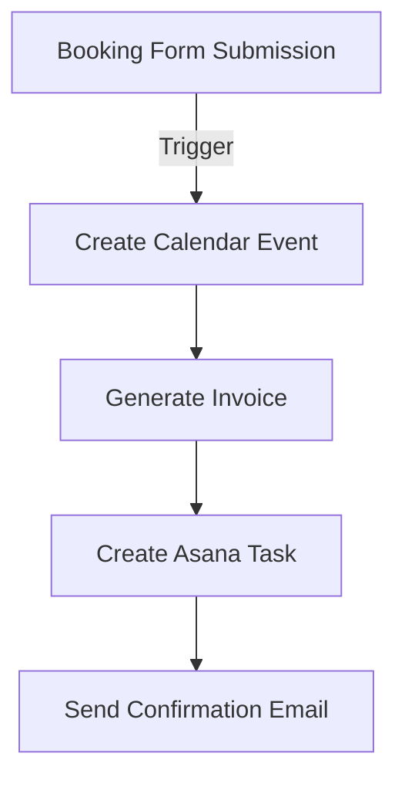
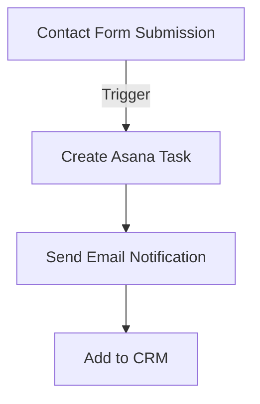

# Integration Plan

## Overview
This document outlines the detailed integration steps for connecting Curl Feather's booking system with external services through Zapier.

## 1. Google Calendar Integration

### Setup Requirements
- Google Cloud Console project
- OAuth 2.0 credentials
- Calendar API enabled

### Implementation Steps
1. Calendar Setup
   ```javascript
   // Calendar event creation structure
   const calendarEvent = {
     summary: 'Drywall Service - [Service Type]',
     description: 'Client: [Name]\nService: [Type]\nDetails: [Description]',
     start: {
       dateTime: '[Selected Date + Time]',
       timeZone: 'America/Denver',
     },
     end: {
       dateTime: '[Selected Date + Time + Duration]',
       timeZone: 'America/Denver',
     },
   };
   ```

2. Availability Checking
   - Query calendar for existing events
   - Block out unavailable time slots
   - Prevent double bookings

## 2. Freshbooks Integration

### Setup Requirements
- Freshbooks API credentials
- Webhook endpoints
- Invoice templates

### Implementation Steps
1. Invoice Generation
   ```javascript
   // Invoice creation structure
   const invoice = {
     client: {
       name: '[Client Name]',
       email: '[Client Email]',
       address: '[Client Address]',
     },
     items: [{
       name: '[Service Type]',
       description: '[Service Description]',
       quantity: 1,
       unit_cost: '[Service Rate]',
     }],
     terms: 'Net 30',
     notes: '[Additional Details]',
   };
   ```

2. Payment Processing
   - Generate payment links
   - Track payment status
   - Send reminders

## 3. Asana Integration

### Setup Requirements
- Asana API tokens
- Project templates
- Task workflows

### Implementation Steps
1. Task Creation
   ```javascript
   // Task creation structure
   const task = {
     name: '[Service Type] for [Client Name]',
     projects: ['[Project ID]'],
     due_on: '[Service Date]',
     notes: `
       Client: [Name]
       Contact: [Phone/Email]
       Service: [Type]
       Details: [Description]
       Location: [Address]
     `,
     tags: ['[Service Type]', 'new-booking'],
   };
   ```

2. Workflow Automation
   - Assign tasks to team members
   - Set due dates
   - Track progress

## 4. Zapier Workflows

### Primary Workflow: New Booking


### Secondary Workflow: Contact Form


### Error Handling
1. Primary Checks
   - Valid date/time selection
   - Complete client information
   - Service type validation

2. Failure Recovery
   - Retry mechanisms
   - Error notifications
   - Manual intervention triggers

## 5. Google Ads Setup

### Campaign Structure
1. Search Campaigns
   - Local service ads
   - Keyword targeting
   - Geographic targeting

2. Conversion Tracking
   - Form submissions
   - Booking completions
   - Phone calls

### Analytics Integration
- Goal setup
- Event tracking
- Conversion attribution

## Implementation Phases

### Phase 1: Basic Integration
- [x] Frontend components ready
- [ ] API authentication setup
- [ ] Basic workflow testing

### Phase 2: Workflow Automation
- [ ] Zapier workflow configuration
- [ ] Error handling implementation
- [ ] Email template setup

### Phase 3: Marketing Integration
- [ ] Google Ads setup
- [ ] Conversion tracking
- [ ] Analytics configuration

## Testing Plan

### Integration Testing
1. Booking Flow
   - Calendar creation
   - Invoice generation
   - Task assignment
   - Email notifications

2. Contact Flow
   - Task creation
   - Email notifications
   - CRM updates

### Error Scenarios
- Network failures
- API limits
- Invalid data
- Service downtime

## Security Considerations

### Data Protection
- API key management
- Data encryption
- Access control
- Audit logging

### Compliance
- GDPR considerations
- Data retention
- Privacy policy
- Terms of service

## Monitoring

### Performance Metrics
- API response times
- Error rates
- Conversion rates
- System uptime

### Alerts
- Integration failures
- API quota usage
- Error thresholds
- System health

## Documentation Requirements

### API Documentation
- Authentication methods
- Endpoint specifications
- Data structures
- Error codes

### User Documentation
- Setup guides
- Troubleshooting
- Best practices
- FAQs

## Maintenance Plan

### Regular Tasks
- API key rotation
- Performance monitoring
- Error log review
- Backup verification

### Update Procedures
- Version tracking
- Changelog maintenance
- Rollback procedures
- Testing protocols
